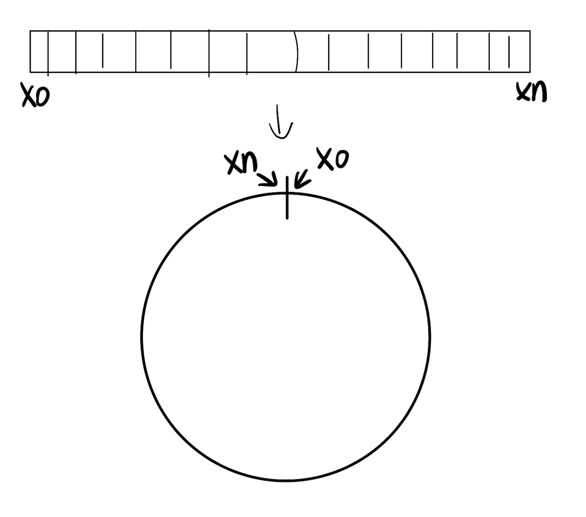
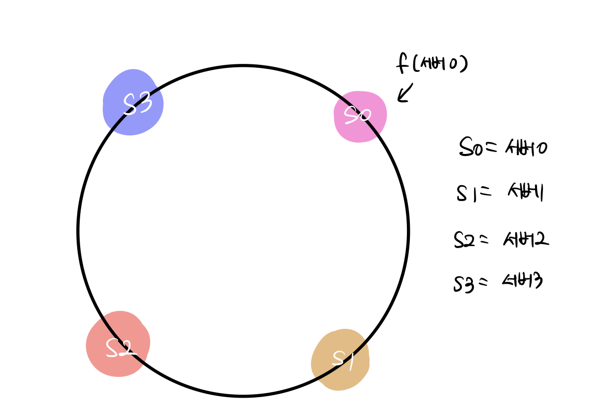
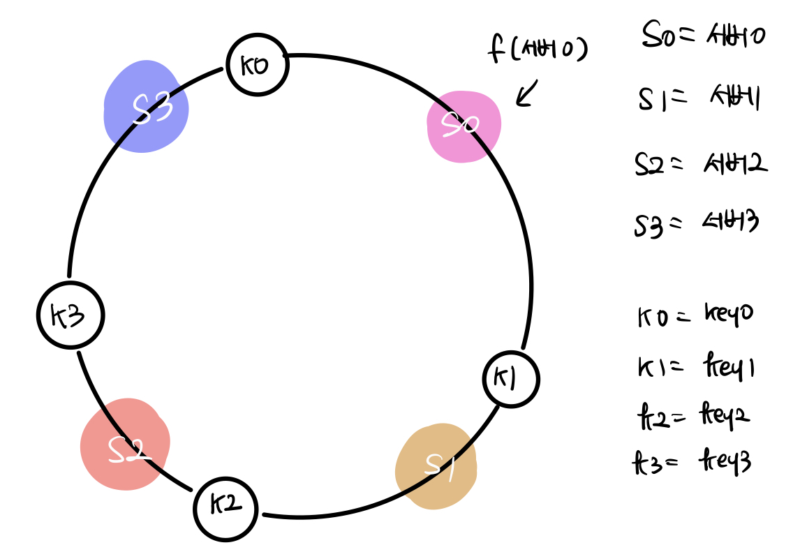
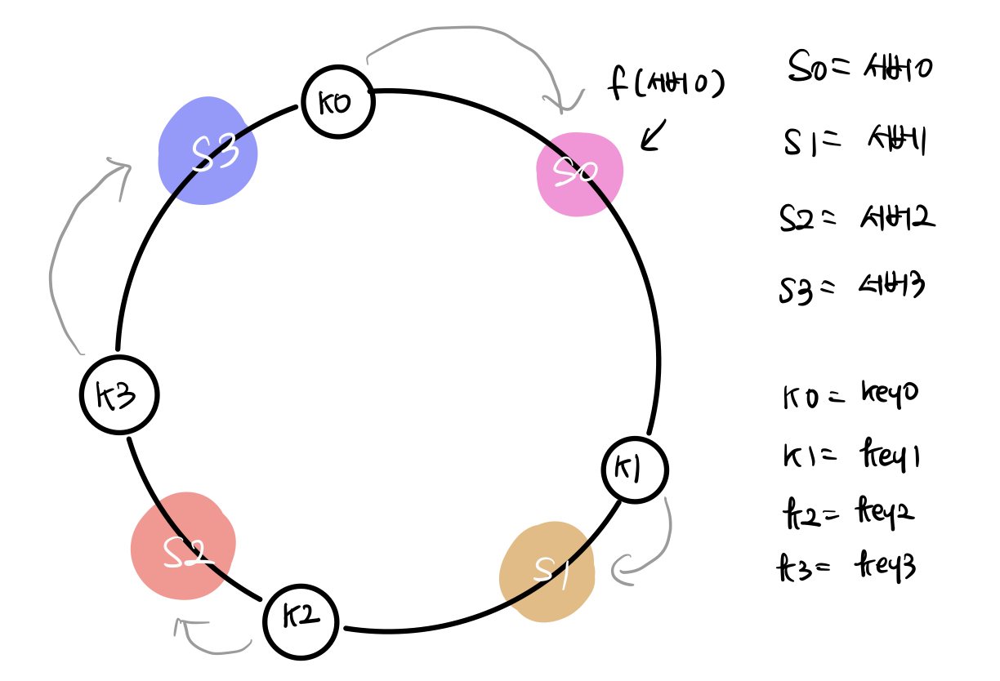
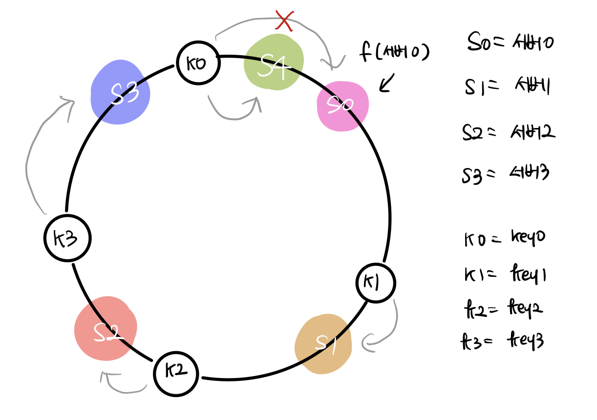
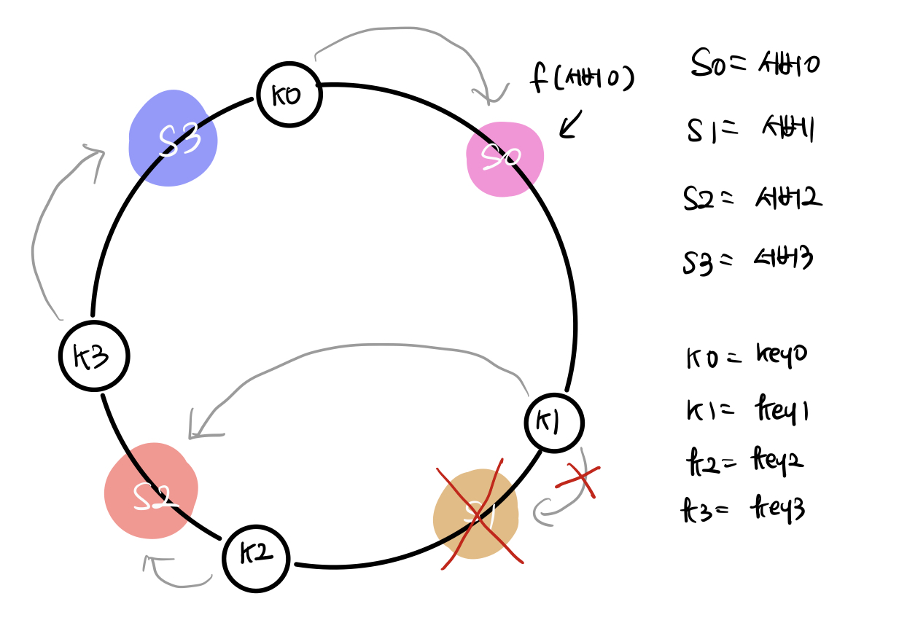
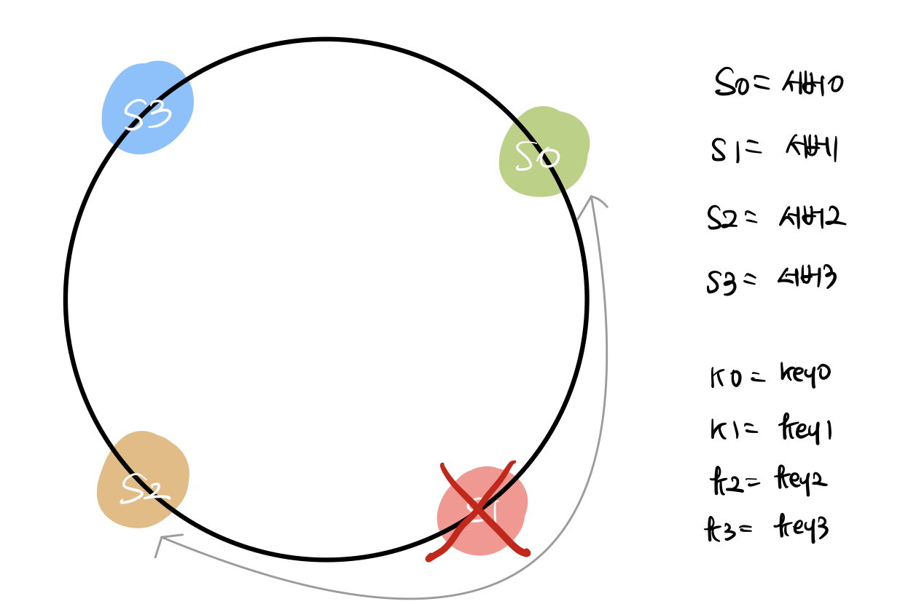
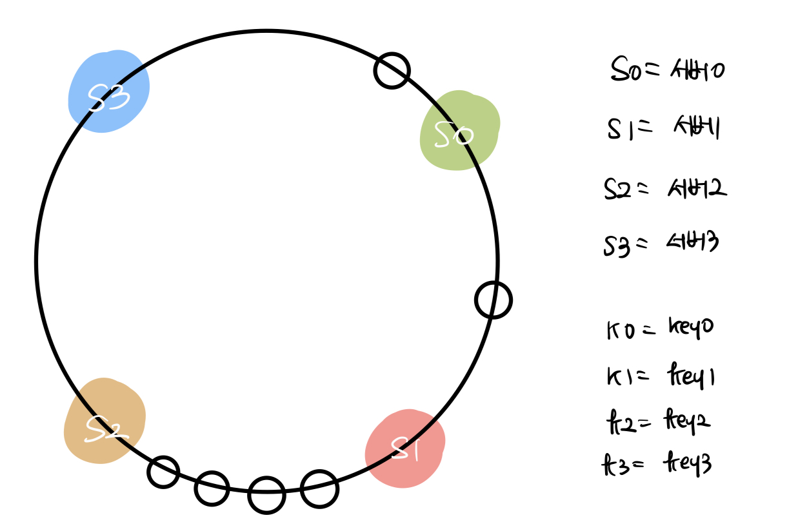
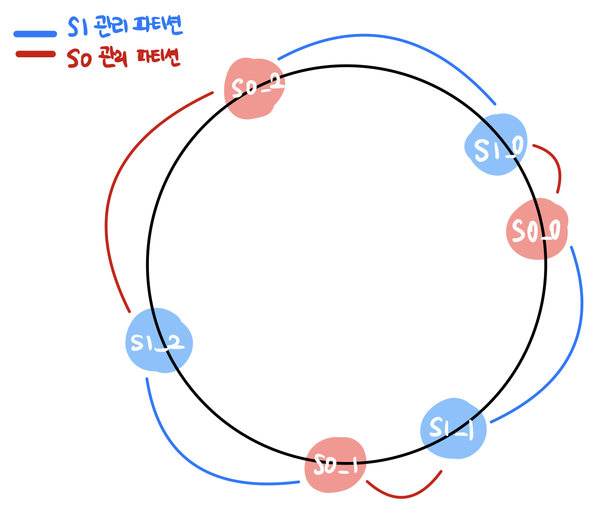
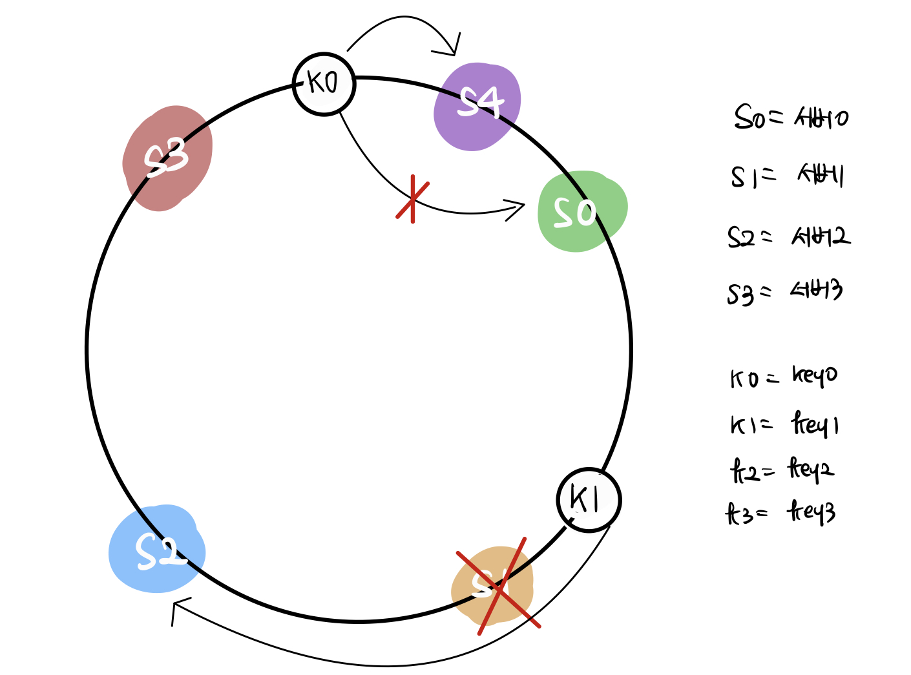

# 5장 안정 해시 설계 (Consistent Hashing)

- 수평적 규모 확장성을 달성하기 위해서는 요청 또는 데이터를 서버에 균등하게 나누는 것이 중요하다. consistent hashing은 이 목표를 달성하기 위해 보편적으로 사용하는 기술이다.

## 해시 키 재배치(rehash) 문제

N개의 캐시 서버가 있을 때 이 서버들에 부하를 균등하게 나누는 보편적인 방법은 아래와 같은 해시 함수를 사용하는 것이다.

```
serverIndex = hash(key) % N (N은 서버의 갯수)
```

이 방식은 server pool의 크기가 고정되어 있을 때, 그리고 데이터 분포가 균등할 때는 잘 동작한다. 하지만 서버가 추가되거나 삭제가 되면 문제가 생긴다. consistent hashing은 서버 수의 변화로 인해 발생할 수 있는 cache miss를 효과적으로 해결할 수 있는 기술이다.

## consistent hash

해시 테이블의 크기가 조정될 때 평균적으로 k/n개의 키만 재배치 하는 해시 기술 (k는 키의 개수, n은 슬롯의 개수)이다. 이와 달리 전통적 해시 테이블은 슬롯의 수가 바뀌면 거의 대부분의 키를 rehashing한다.

### 해시 공간과 해시 링

해시 함수 f로는 SHA-1을 사용하고, 이 함수의 출력 값 범위 x0, x1, ... , xn이다.

이 범위(공간)을 그림으로 표현하여 양끝을 구부려 접으면 다음과 같은 해시 링이 탄생한다.



### 해시 서버

해시 함수 f를 사용하면 서버 IP나 이름을 링위의 어떤 위치에 대응시킬 수 있다. 아래 그림은 4개의 서버를 해시 링 위에 배치한 결과다.



### 해시 키

*여기서 사용된 해시 함수는 해시 키 재배치(rehash) 문제에서 언급한 함수와는 다르며, 나머지 연산을 사용하지 않고 있다.*

아래 그림과 같이 캐시할 키를 해시 링 위의 어느 지점에 배치할 수 있다.



### 서버 조회

어떤 키가 저장되는 서버는, 해당 키의 위치로부터 시계 방향으로 링을 탐색해나가면서 만나는 첫 번째 서버다. 아래 그림에서 key0은 서버 0에 저장되고, key1은 서버 1에 저장되며 key2는 서버2, key3은 서버3에 저장된다.



### 서버 추가

방금 설명한 내용에 따르면, 서버를 추가하더라도 키의 일부만 재배치 된다. 아래 그림에서 서버 4가 추가되었지만 key0만 재배치 된다. 서버 4가 추가된 이후로 key0가 시계 방향으로 순회했을 때 처음으로 만나게 되는 서버가 서버4가 되기 때문이다. 다른 키들은 재배치 되지 않는다.



### 서버 제거

하나의 서버가 제거되면 키의 일부만 재배치 된다. 아래 그림에서 서버 1의 제거로 key1만 재배치 된다.



### 기본 구현법의 두 가지 문제

안정 해시 알고리즘은 MIT에서 처음 제안되어 그 기본 절차는 다음과 같다

1. 서버와 키를 균등 분포 (uniform distribution) 해시 함수를 사용해 해시 링에 배치한다.
2. 키의 위치에서 링을 시계 방향으로 탐색하다 만나는 최초의 서버가 키가 저장될 서버다.

이 접근법에는 두가지 문제가 있다.

1. 서버수의 변경이 일어나면 파티션의 크기를 균등하게 유지하는게 불가능하다

   1. 파티션은 인접한 서버 사이의 해시 공간

   2. 어떤 서버는 굉장히 작은 해시 공간을 할당 받고, 어떤 서버는 굉장히 큰 해시 공간을 할당 받는 상황이 가능하다.
      아래 그림에서 s2는 s1이 제거되어 파티션이 다른 파티션 대비 두 배 가량 커진다.

      

2. 키의 균등 분포가 어렵다
   아래 그림에서 s0, s1, s3는 아무 데이터도 갖지 않는 반면 대부분의 키는 s2에 보관될 것이다.

   

이 문제를 해결하기 위해 제안된 기법이 virtual node 또는 replica라 불리는 기법이다.

#### 가상 노드 (virtual node)

virtual node는 실제 노드 또는 서버를 가리키는 노드로서 하나의 서버는 링 위에 여러개의 가상 노드를 가질 수 있다. 아래 그림을 보면 서버 0과 서버 3은 3개의 가상 노드를 갖으며, 실제로는 이보다 훨씬 큰 값이 사용된다. 이 두 서버를 링에 배치할 때는 s0,s1~ s0-3,s1-3 세개의 가상 노드를 사용했고 이로 인해 각 서버는 하나가 아닌 여러개의 파티션을 관리해야 한다. s0으로 표시된 파티션은 s0이 관리하는 파티션이고 s1으로 표시된 파티션은 s1이 관리하는 파티션이다.



가상 노드의 개수를 늘리면 키의 분포는 점점 균등해진다. 표준 편차는 데이터가 어떻게 퍼져 나갔는지를 보이는 척도다. 가상 노드의 개수를 늘리면 표준 편차의 값은 떨어지지만, 가상 노드 데이터를 저장할 공간은 더 많이 필요하게 된다. tradeoff가 필요하다. 따라서 시스템 요구사항에 맞도록 가상 노드 개수를 적절히 조절해야 한다.

### 재배치할 키 결정

서버가 추가되거나 제거되면 데이터 일부는 재배치 해야 한다. 어느 범위의 키들이 재배치되어야 할까?

아래와 같이 서버 4가 추가된경우, s3~s4 구간의 키가 s4로 재배치 되어야 한다. 또, 서버 1이 삭제될 경우 서버 0에서 서버 1사이의 키가 서버2로 재배치 되어야 한다.



### 정리

안정해시의 이점은 다음과 같다.

- 서버가 추가되거나 삭제될 때 재배치 되는 키의 수가 최소화된다.
- 데이터가 보다 균등하게 분포하게 되므로 수평적 규모 확장성을 달성하기 쉽다.
- 핫스팟 키문제를 줄인다. 특정한 샤드에 대한 접근이 지나티게 빈번하면 서버 과부하가 생길 수 있다. 안정 해시는 데이터를 좀 더 균등하게 분배하므로 이런 문제가 생길 가능성을 줄인다.

안정 해시는 실제로 널리 쓰이고 있으며, 유명한 사례는 아래와 같다.

- 아마존 다이나모 DB의 파티셔닝 관련 컴포넌트
- 아파치 카산드라 클러스터에서의 데이터 파티셔닝
- 디스코드 채팅 앱
- 아카마이 CDN
- 메그래프 네트워크 부하 분산기

