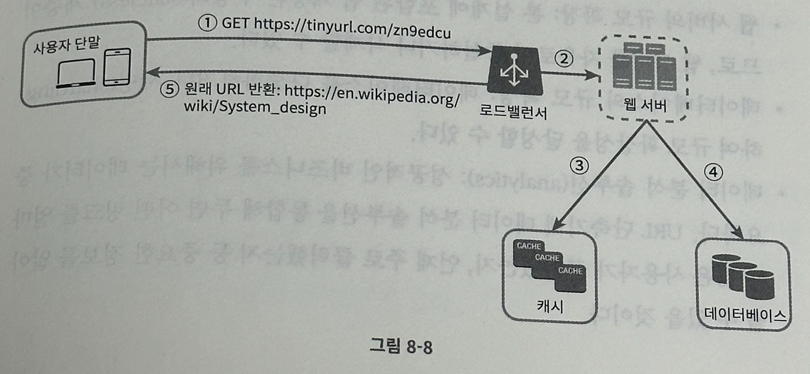

# 8장 URL 단축키 설계

## 1단계 문제 이해 및 설계 범위 확정

1. URL 단축: 주어진 긴 URL을 훨씬 짧게 줄인다.
2. URL 리디렉션: 축약된 URL로 HTTP 요청이 오면 원래 URL로 안내
3. 높은 가용성과 규모 확정성, 그리고 장애 감내가 요구됨

## 2단계: 개략적 설계안 제시 및 동의 구하기

#### API 엔드포인트

URL 단축기는 기본적으로 두 개의 엔드포인트를 필요로 한다.

1. URL 단축용 엔드포인트: 새 단축 URL을 생성하고자 하는 클라이언트는 이 엔드포인트에 단축할 URL을 인자로 실어서 POST로 보내야 한다.
2. URL 리디렉션용 엔드포인트: 단축 URL에 대해서 HTTP 요청이 오면 원래 URL로 보내주기 위한 용도의 엔드포인트\

#### URL 리디렉션

단축 URL을 받은 서버는 그 URL을 원래 URL로 바꿔서 301 응답의 Location 헤더에 넣어 반환한다. 여기서 301과 302 모두 리디렉션 응답이긴 하지만 차이가 있다.

- 301 Permanetly Moved: 해당 URL에 대한 HTTP 요청의 처리 책임이 영구적으로 Location 헤더에 반환된 URL로 이전됐다라는 응답. 영구적으로 이전된 것이므로, 브라우저는 이 응답을 캐시한다. 따라서 추후 같은 단축 URL에 요청을 보낼 필요가 있을 때 브라우저는 캐시된 원래 URL로 요청을 보내게 된다.
- 302 Found: 일시적으로 Location 헤더가 지정하는 URL로 처리한다. 따라서 클라이언트의 요청은 언제나 단축 URL에 먼저 보내진 후 원래 URL로 리디렉션 된다.

두 응답의 장단점

- 301 Permanent Moved: 서버 부하를 줄일 때 용이. 첫 번째 요청만 단축 URL 서버로 전송된다.
- 302 Found: 트래픽 분석이 중요할 때 용이: 클릭 발생률, 발생 위치 추적에 유리

URL 리디렉션을 구현하는 가장 직관적인 방법은 `<단축 URL, 원래 URL>` 의 쌍을 해시 테이블에 저장하는 것이다. 이 방법을 사용한다고 가정하면 다음과 같이 만들 수 있다.

- 원래 URL = 해시테이블(단축URL)
- 301 또는 302 응답 Location 헤더에 원래 URL을 넣은 후 전송

#### URL 단축

단축 URL: `www.tinyurl.com/{hashValue}`

- 이 URL을 `hashValue` 로 대응시킬 해시 함수를 찾는 게 중요하다.
- 이 해시 함수의 요구사항은 다음과 같다.
  - 입력으로 주어지는 긴 URL이 다른 값이면 해시 값도 달라야 한다.
  - 계산된 해시 값은 원래 입력으로 주어졌던 긴 URL로 복원될 수 있어야 한다.

## 3단계 상세 설계

#### 데이터 모델

앞서 개략적 설계에서는 모든 것을 해시테이블에 담았다. 이 접근법은 초기에는 괜찮지만 실제 시스템에서는 어렵다. 메모리는 유한하고, 비싼 자원이기 때문이다. 더 나은 방법은  `<단축 URL, 원래 URL>` 의 순서쌍을 DB에 저장하는 것이다. DB에는 이 순서쌍을 id, shortUrl, longUrl 세 개의 칼럼을 갖는 테이블에 저장한다. (중요한 칼럼만 추렸을 때)

#### 해시 함수

원래 URL을 단축 URL로 변환하는데 쓰인다. 편의상 해시 함수가 계산하는 단축 URL 값을 hashValue라고 지칭하겠다. 

##### 해시 값 길이

hashValue는 [0-9, a-z, A-Z] 총 62개의 문자로 구성된다. hashValue의 길이를 구하려면 62의 N승 >= 3650인 N의 최솟값을 찾아야 한다. 개략적으로 계산했던 이 시스템의 추정치에 따르면 3650억개의 URL을 만들어낼 수 있어야 한다. 따라서 N=7로 사용한다. 이렇게 할 경우 3.5조개의 URL을 만들 수 있다.

##### 해시 후 충돌 해소

긴 URL을 줄이려면 원래 URL을 7글자로 줄이는 해시 함수가 필요하다. 손쉬운 방법은 CRC32, MD5, SHA-1과 같이 잘 알려진 해시 함수를 이용하는 것인데, 이들 해시 함수의 결과로 나온 해시 값은 모두 7글자가 넘는다. 이 값을 어떻게 하면 줄일 수 있을까?

이 문제를 해결할 첫번째 방법은 계산된 결과에서 앞 7개 글자만 이용하는 것이다. 하지만 이렇게 할 경우 충돌될 확률이 높아진다. 충돌이 실제로 발생했을 때는, 충돌이 해소될 때까지 사전에 정한 문자열을 해시 값에 덧붙인다. 이 방법은 충돌을 해소할 수 있지만 단축 URL을 생성했을 때 한 번 이상 DB를 질의해야 하므로 오버헤드가 크다. 

데이터베이스 대신 블룸 필터를 사용하면 성능을 높일 수 있다. 블룸필터는 어떤 집합에 특정 원소가 있는지 검사할 수 있도록 하는 확률론에 기초한 공간 효율이 좋은 기술이다.

##### base-62 변환

- hashValue에 사용할 수 있는 문자 개수가 62이기 때문에 62진법을 사용한다. 
- 62진법은 총 62개의 문자 [0-9, a-z, A-Z] 를 사용한다.
- `www.tinyurl.com/{hashValue}` 의 `hashValue` 부분을 62진법을 이용해 변환한다

##### 해시 후 충돌 해소 vs base-62 변환

| 해시 후 충돌 해소                                            | base-62 변환                                                 |
| ------------------------------------------------------------ | ------------------------------------------------------------ |
| 단축 URL의 길이가 고정됨                                     | 단축 URL의 길이가 가변적. ID가 커지면 같이 길어짐            |
| 유일성이 보장되는 ID 생성기가 필요치 않음                    | 유일성 보장 ID 생성기가 필요                                 |
| 충돌이 가능해서 해소 전략 필요                               | ID의 유일성이 보장된 후에야 적용 가능한 전략이기 때문에 충돌은 아예 불가능 |
| ID로부터 단축 URL을 계산하는 방식이 아니라 다음에 쓸 수 있는 URL을 알아내는 것이 불가능 | ID가 1씩 증가하는 값이라고 가정하면 다음에 쓸 수 있는 단축 URL이 무엇인지 쉽게 알 수 있어 보안상 문제가 될 소지가 있음 |

##### URL 단축기 상세 설계

- base-62진법 변환을 사용하여 설계한다.

1. 입력으로 긴 URL을 받는다.
2. 데이터베이스에 해당 URL이 있는지 확인한다.
3. 해당 URL이 있다면 단축 URL을 가져와서 반환한다.
4. 없다면 해당 URL에 대한 유일한 ID를 생성한다. 이 ID는 데이터베이스의 기본 키로 사용된다.
5. 62진법 변환을 적용해 ID를 단축 URL로 만든다.
6. ID, 단축 URL, 원래 URL로 새 데이터베이스 레코드를 만든 후 단축 URL을 클라이언트에 전달한다.

4단계에서 사용하는 ID 생성기는 단축 URL을 만들 때 필요한 ID를 만들고, 이 ID는 전역적 유일성이 보장되어야 한다. 이 방법에 대해서는 6장을 다시 살펴보자

##### URL 리디렉션 상세 설계

쓰기보다 읽기를 더 많이 하는 시스템이기 때문에  `<단축 URL, 원래 URL>` 의 쌍을 캐시에 저장하여 읽기 속도를 높였다.

로드밸런서의 동작 흐름은 다음과 같이 요약할 수 있다.

1. 사용자가 단축 URL을 클릭한다.
2. 로드밸런서가 해당 클릭으로 발생한 요청을 웹 서버에 전달한다.
3. 단축 URL이 이미 캐시에 있는 경우에는 원래 URL을 바로 꺼내서 클라이언트에게 전달한다.
4. 캐시에 해당 단축 URL이 없는 경우에는 데이터베이스에서 꺼낸다. DB에 없다면 아마 사용자가 잘못된 단축 URL을 입력한 경우일 것이다.
5. 데이터베이스에서 꺼낸 URL을 캐시에 넣은 후 사용자에게 반환한다.

## 4단계 마무리

시간이 남는다면 면접관과 다음과 같은 내용에 대해 추가로 이야기 해 볼 수 있다.

1. 처리율 제한 장치(rate limiter): 지금까지 살펴본 시스템은 엄청난 양의 URL 단축 요청이 들어 올 경우 무력화 될 수 있다는 잠재적 보안 결함을 갖고 있다. 처리율 제한 장치를 통해 필터링 규칙을 설정하여 요청을 걸러낼 수 있다.
2. 웹 서버의 규모 확장:  본 설계에 포함된 웹 계층은 stateless이다. 따라서 웹 서버를 자유로이 증설하거나 삭제할 수 있다.
3. 데이터베이스의 규모 확장: 데이터베이스를 다중화하거나 샤딩하여 규모 확장성을 달성할 수 있다.
4. 데이터 분석 솔루션: URL 단축기에 분석 솔루션을 통합해 두면 어떤 링크를 얼마나 많은 사용자가 클릭했는지 등의 중요한 정보를 알아낼 수 있다.
5. 가용성, 데이터 일관성, 안정성: 대규모 시스템이 성공적으로 운영되기 위해 반드시 갖추어야 할 속성들이다.
